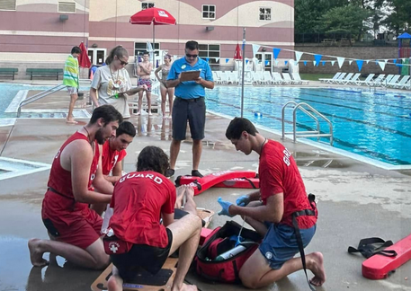
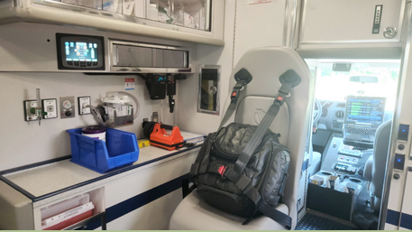
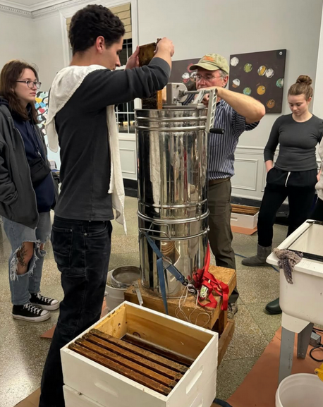

> "...lay down in the sunlight, on pine needles, indifferent to the busy ants, the scrabbling squirrels, the crested jays, the galaxies of midges dancing in the sunrays, and slept."
- The Monkey Wrench Gang, by Edward Abbey, one of my [favorite books](./favorite-books.html).

# Introduction

---

 
My name is David Abersold. I am a sophomore psychology, neuroscience, and premedicine student at Miami University of Ohio. I am also a National Registry certified EMT, a lifeguard, and an admirer of living things. I have loved learning about the intricacies of organic things and how they coalesce into the comfortable, familiar, and the challenging.

<a href="mailto:davidabersold@gmail.com">Contact David Abersold</a>

# Education

Undergraduate psychology, neuroscience, and premed student at Miami University of Ohio graduating in 2027

Downingtown East High School, Exton, Pennsylvania; graduated in 2023 

My [course work](./Coursework.html) has been cross-disciplinary, between my major and two co-majors.

# Work Experience

---

## Lifeguard

* 2021-2025, approx. 60 hrs/month
*Lifeguarded at YMCA summer camps, indoor/outdoor pools, and country clubs, where we were tested with live drills monthly. Certified in CPR/Oxygen/Rescue by Ellis & Associates.

My longest held position, I have been going to the Lionville YMCA since I was a child. Where many friends who worked different jobs eventually left in frustration after a year or two, I have felt no need to leave except for new opportunities. I attribute this first to the kind people who work there, and to the communal nature of the building. It is satisfying to have a consistent community and administration that is responsive and present.

*Training drill at our "Lifeguard Games" event.* 

## National Registry EMT

* June 2024, approx 40 hours

As part of certification, worked a total of 40 hours including responding to 12 calls as a third crew-member, alongside paramedics, EMTs, and AEMTs. Trained by [Uwchlan Ambulance](https://www.station87.com/), my local and well respected ambulance company, and the National Registry on August 24th, 2024.

*My Office*
  
# Clubs and Organizations

---

## Climbing Club Safety Officer/Leader

* 2023 - Present, approx 20 hours/month
    [Miami University's Climbing club](https://miamioh.campuslabs.com/engage/organization/mubc) that organized trips to various climbing areas in the Midwest. Known as a tight-knit community and one that inspires me to value the bonds between people the most. Certified in Wilderness First Aid by Wilderness Medical to promote safety in our sometimes dangerous sport.

Climbing takes place in many natural areas claimed by the US government and private owners. Often, they are under threat of destructive development or privatization. Protecting these places from closure is important to me as a political issue.

## EMS Club Member

* 2025 - Present, approx 10 hours/month
    Newly founded club that supports student EMS development as well as operating classes for programs such as Stop the Bleed and CPR.

## International Adolescent Health Week Committee Member

* 2021-2022, approx. 10 hrs/month
    Worked alongside Dr. Laura Offutt, founder and director of International Adolescent Health Week to create events and messages that would promote adolescent health. Ex. A cooking event to teach a simple and healthy recipe. I was compensated via stipend.

## Boy Scouts of America

* 2016-2022, approx. 20 hrs/month
    My introduction to first aid & responsible outdoorsmanship, and the seed for a love of nature. Plenty of community volunteering/projects (eg. preserving and marking trails, senior living volunteering, the classic boy scout bench project)

# Hobbies/Other Activities

---

## Miami Apiculture Society

A [beekeeping club](https://www.instagram.com/miamibees/) based around managing our ~6 hives on campus, and producing honey and other wax based products as well as advocacy for wilderness protection. We are guided by distinguished beekeeper and scientist Alex Zomchek. His knowledge is valuable to us, as well as his wisdom. Mr. Zomchek is known among us for his love of metaphor and allegory when talking about his bees, and there is so much that can be applied to bees. I find that they are a fun and approachable allegory to the hierarchical structure of our bodies, with each bee of thousands representing cells, dancing and secreting pheromones to communicate with each-other in charming ways. Like our brains, the bees sit in a chemical bath of complicated enzymes and neurotransmitters that fall in and out of balance. Beyond that, it is nice to have a casual academic interest that is as peaceful as bees. Many of us describe the enveloping sound of soft buzzing as being like music, a natural white noise.

*Operating a hand-crank centrifuge to extract honey from hive frames*

## Outdoors

I enjoy mountain biking and rock climbing often. The recentering effect of being in nature has been important to me all my life. I competed on mountain biking teams back home in Pennsylvania and at Miami’s own climbing competitions.  

## Why Does this Resume Look Like This?

In my free time, I like to edit and read Wikipedia, in both academic domains and wherever else I have the credentials. It is a wonderful way to discover new things and a miracle that so many talented scholars have contributed to create an open-sourced way to disseminate information about absolutely everything. So, this page is designed in the Wikimedia Foundations own MediaWiki, which is also an open-source tool. It is a framework I am familiar with and consider to be an effective and flexible way of compiling information, as a resume should be. 
